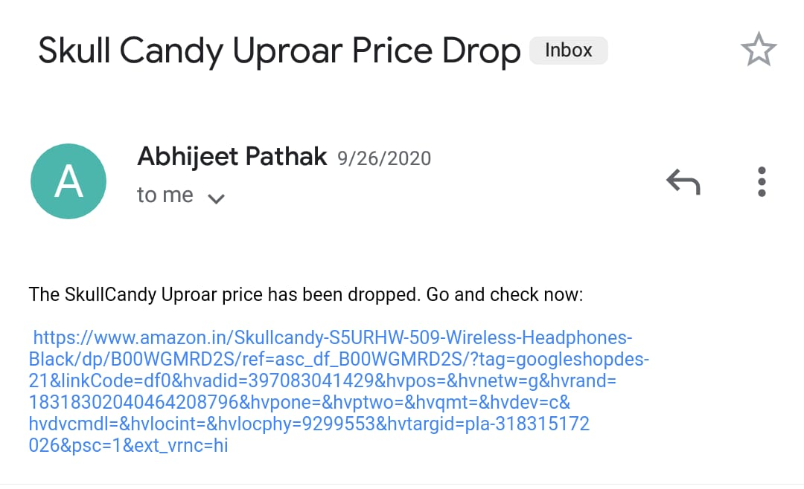

# A price tracker for e-commerce websites
I think we all are familiar with the feeling when we visit any e-commerce website to buy a product and it is out of our budget. At that moment we all wish to have someone or something who could tell us whenever the price goes down.

Here I have tried to build a similar kind of thing which will inform us through a mail whenever the price of desired product comes down the budget.

***Note:*** *This is a prototype which currently works only on Amazon.com but it can be easily modified to work on other e-commerce websites like Flipkart, Snapdeal, etc as well.*

### Input:
When this script runs, you will be asked to - 
- Enter the product page url.
- Enter your email id.
- Enter your desired price.

### Output:
Whenever the price goes down you desired price you will recieve a mail which will redirect you to the product page. The mail looks like this -

